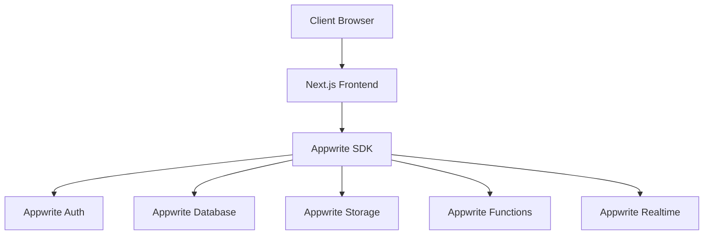

# TuneUP - System Patterns

## Architecture Overview

TuneUP follows a modern web application architecture with:
- Client-side rendering using Next.js
- Appwrite as the backend-as-a-service (BaaS)
- Enhanced UI interactions via GSAP

## Component Organization

The frontend is organized into:
- Layouts (page structures)
- Components (reusable UI elements)
- Pages (route-specific views)
- Utils (helper functions)
- Hooks (custom React hooks)
- Services (API interaction layers)

## Data Flow Patterns

### Authentication Flow
1. User initiates auth through UI
2. Next.js routes to Appwrite Auth
3. Appwrite manages OAuth or credential verification
4. JWT tokens stored for session management
5. User state updated through React context

### Content Storage Pattern
1. Media uploads processed client-side
2. Files sent to Appwrite Storage
3. File IDs stored in database collections
4. CDN URLs used for client-side rendering

### Realtime Updates
1. Client subscribes to relevant collections
2. Appwrite Realtime streams updates
3. React state updates on new data
4. UI reflects changes immediately

## Animation Patterns

### Scroll-Based Animations
- ScrollTrigger for activating animations on scroll
- SmoothScroll for enhanced scrolling experience
- Animation sequences tied to scroll position

### Component Entry Animations
- Reveal animations for components entering viewport
- Staggered animations for lists and grids
- Consistent animation timings for UI cohesion

## State Management

- React Context for global state
- Local component state for UI-specific states
- Appwrite Realtime for synchronized data

## Error Handling

- Consistent error boundaries at page level
- Toast notifications for user feedback
- Fallback UI components for failed loads

## Responsive Design Approach

- Mobile-first design strategy
- Tailwind breakpoints for consistent responsive behavior
- Custom GSAP animations adjusted for device capabilities 